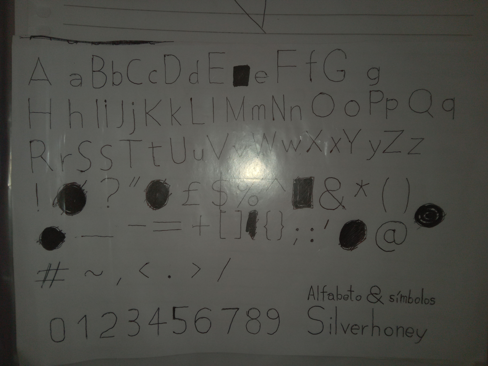
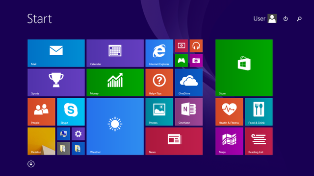

# Silverhoney

Silverhoney is a font that aims to be close to what is used in Windows 8.1 Metro.



## Requirements

* [ ] Coordinates ($x, y$) are zero or power of two, so that the font may be rendered either in the graphics processing unit (GPU) or in the central processing unit (CPU). Therefore, the font is intended to be quadratic, with certain curve control points.
* [ ] The font is Extra Light, therefore shapes are initially built as segment paths (partial shapes)
* [ ] After a partial shape is complete, select all of its points and select <kbd>Element > Expand Stroke</kbd> and expand stroke by Major Axis (width) = 1 and Minor Axis (height) = 1 and Nib Angle = 45.
* [ ] Font design size = must be lower than the maximum bottom-top size, but at the same time both must be quadratic
* [ ] Close shapes in the clockwise orientation starting from $(0, 0)$ ($x, y$).

## What do you mean

* [x] Maximum bottom-top = 512pts
* [x] Font design size = 256pts

I am trying just the period (**.**). No character other than U+00002E (U+2E; `&#x2E;`; number 46; `0x2E`) (in which case a fallback font may be used).

## Tasks

### Project format

Usually the font is designed in FontForge and may then be exported to TTF and other formats.

### Characters

```
. ! ? : , ; ~ * _ - = + ´ ` < > / \ # ^ %
£ $ & ( ) [ ] { } @
0 1 2 3 4 5 6 7 8 9
A a B b C c D d E e F f G g H h I i J j K k L l M m N n O o P p Q q R r S s T t U u V v W w X x Y y Z z
Ç ç
```

Done:

```
.
```

## More

* [How to finish a letter in FontForge adding a horizontal line into a triangle](https://graphicdesign.stackexchange.com/questions/165667/how-to-finish-a-letter-in-fontforge-adding-a-horizontal-line-into-a-triangle/165671#165671)

## Period character bug

The font currently contains the period (**.**) character (U+2E) and nothing else (there is no other character in this font other than U+2E, the period character; and I want to render it in GPU).

I am getting the following errors:


> Self-intersection in the period U+2E (**.**).
> Missing points at extrema in the period U+2E (**.**).

I am trying to make the period as if it were just a Light square for the Metro design!

> I am trying just the period (**.**). No character other than U+00002E (U+2E; `&#x2E;`; number 46; `0x2E`) (in which case a fallback font may be used).

## Contributing

The font is developing in the FontForge application, which generally works in all Windows and Unix kernels.

The FontForge project is a file terminating with the **.s1fd.sfd** extension and the filename starts with **project-** followed by a number. For example:

* **project-1**.s1fd.sfd
* **project-2**.s1fd.sfd

These project files are eventually uploaded to this repository.

## My goals

<blockquote>

Yeah, my first Windows 8 was a cheap touchscreen laptop with Windows 8.1, ARM64 or AVMv7, and Tegan and Sara wallpapers, minimalist Halo wallpaper and more.

There in 2015 (~999.99 BRL), or 1000 BRL (R$1.000,00). In EUROS: 999,99R$ (or 1.000,00R$) * 00,17£ (or 0.17 euros) = ~170,00£

That laptop was a laptop-tablet; you could plug the keyboard off the tablet. It was nice, but it could have been a bit bigger, except the keyboard could stay as is.

SAMSUNG? Probably yes. I have never used any Apple thing; Unix, Ubuntu, Linux a little. My first OS was probably Windows Vista or Windows 7, where I remember Purble Place, Pinball, and Windows Media Center (big picture).

My current laptop (notebook here in Portuguese) is a SAMSUNG brand (NP350XBE-KDABR), but I striked Windows 10/11 off and got to Unix (Linux Mint). I have already switched to any Unix variant sometimes, but did not go further in.

Windows is really powerful, but ultimately, after Windows 8.1, the new Fluent design doesn't make me happy. Windows 10 was still half Metro, but mostly Fluent. Windows 11 is totally the Fluent design mostly.

</blockquote>

My previous imitations of some variations of the Metro design:


<blockquote>

Looks Xbox. I have never owned a Xbox either but I have seen a few shots of the GUI. I have owned mostly Windows, Android, Sony PlayStation, Sega Master System, something Lenox that plays lots of things (games from NES, and a Dynavision).

</blockquote>
