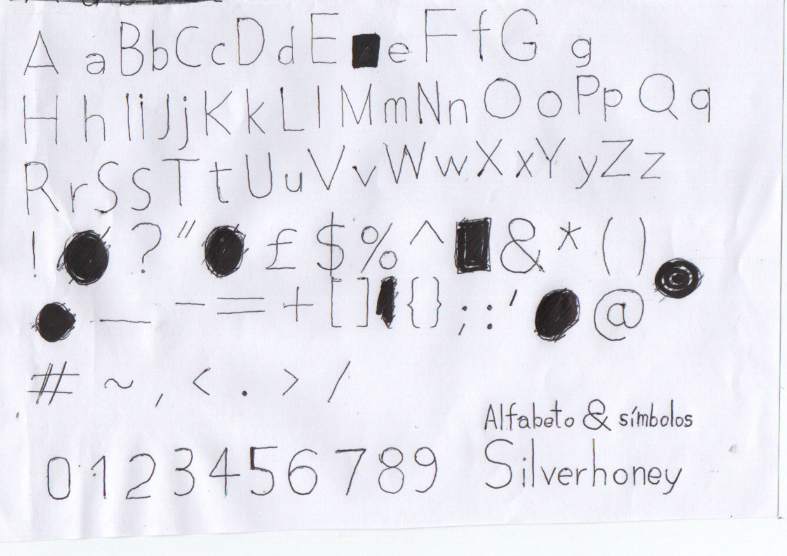

# Silverhoney

Silverhoney is a font that aims to be close to what is used in Windows 8.1 Metro.


Some mimmick:


## Tasks

### Project format

Usually the font is designed in the FontForge program and may then be exported to TTF and other formats.

### Characters

```
. ! ? : , ; ~ * _ - = + ´ ` < > / \ # ^ %
£ $ & ( ) [ ] { } @
0 1 2 3 4 5 6 7 8 9
A a B b C c D d E e F f G g H h I i J j K k L l M m N n O o P p Q q R r S s T t U u V v W w X x Y y Z z
Ç ç
```

Done:

```
.
```

## More

* [How to finish a letter in FontForge adding a horizontal line into a triangle](https://graphicdesign.stackexchange.com/questions/165667/how-to-finish-a-letter-in-fontforge-adding-a-horizontal-line-into-a-triangle/165671#165671)

## Contributing

The font is developing in the FontForge application, which generally works in all Windows and Unix kernels.

The FontForge project is a file terminating with the **.s1fd.sfd** extension and the filename starts with **project-** followed by a number. For example:

* **project-1**.s1fd.sfd

These project files are eventually uploaded to this repository.

### Contributing to in FontForge

* [ ] The font is Light, therefore shapes are initially built as segment paths (partial shapes)
* [ ] After a partial shape is complete, select all of its points and select <kbd>Element > Expand Stroke</kbd> and expand stroke by Major Axis (width) = 128 and Minor Axis (height) = 128 and Nib Angle = 45.
* [ ] Close shapes in the clockwise orientation, but subtraction ones in counterclockwise orientation.
* [ ] You may want to round the coordinates to an integer by selecting all points and clicking <kbd>Element > Round > To Int</kbd>, solving the "Non-uniform coordinates" problem.
